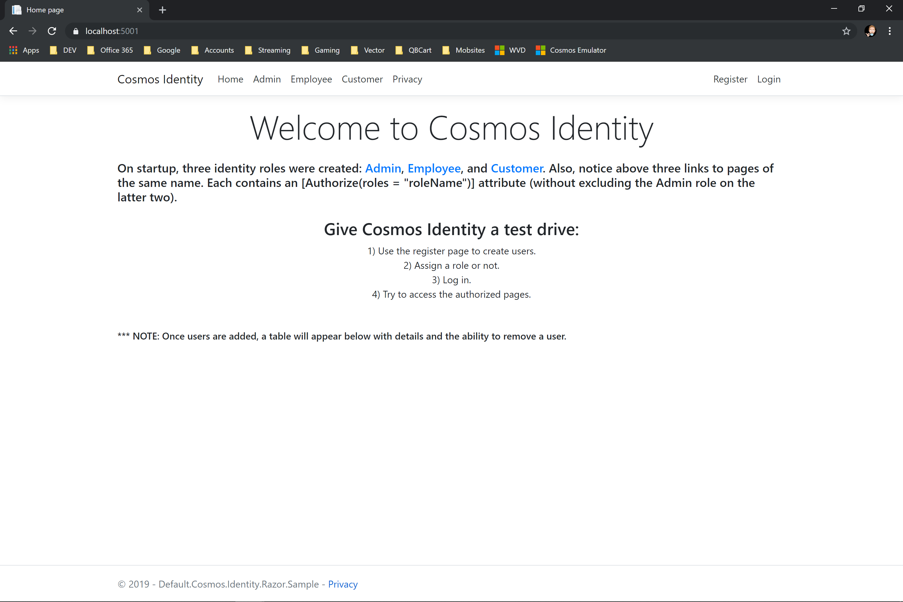
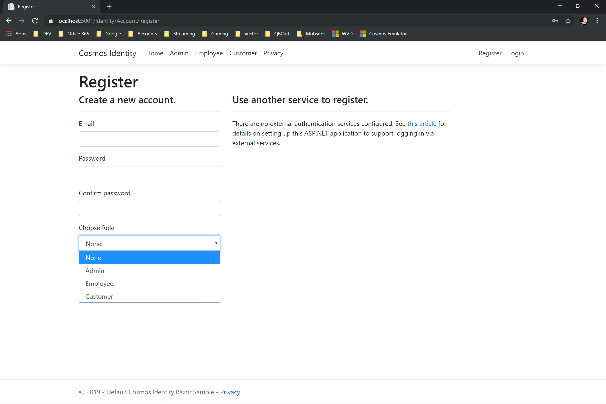
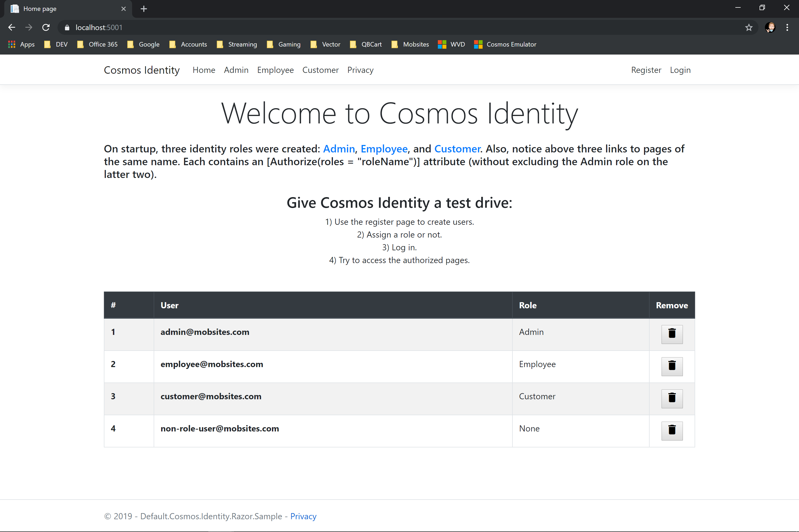

# Cosmos Identity

Cosmos Identity is a storage provider for [ASP.NET Core Identity](https://docs.microsoft.com/en-us/aspnet/core/security/authentication/identity?view=aspnetcore-3.0&tabs=visual-studio) that uses [Azure Cosmos DB](https://azure.microsoft.com/en-us/services/cosmos-db/) as the identity store. This library supports the same identity use cases and features that the default Entity Framework Core implementation does out of the box.

**NOTE: In step with Azure Cosmos, which has moved away from non-partitioned containers, this library supports partitioned containers only.**

## Dependencies

###### .NETStandard 2.0
* Microsoft.Azure.Cosmos (>= 3.4.1)
* Microsoft.AspNetCore.Identity (>= 2.2.0)
* Microsoft.Extensions.Identity.Stores (>= 2.2.0)
* System.Text.Json (>= 4.6.0)

## Design and Development

The open-source [Microsoft.AspNetCore.Identity](https://github.com/aspnet/AspNetCore/tree/master/src/Identity) library and its [Microsoft.AspNetCore.Identity.EntityFrameworkCore](https://github.com/aspnet/AspNetCore/tree/master/src/Identity/EntityFrameworkCore/src) implementation were used as the principal guide in design and development. As such, Cosmos Identity supports the same identity use cases and features that the default `Microsoft.AspNetCore.Identity.EntityFrameworkCore` implementation does out of the box. 

Also considered during development were two third party Cosmos-based solutions:

* Bernhard Koenig's [AspNetCore.Identity.DocumentDb](https://github.com/codekoenig/AspNetCore.Identity.DocumentDb), which uses the older `Microsoft.Azure.DocumentDB.Core` SDK.

* f14shm4n's [AspNetCore.Identity.DocumentDb](https://github.com/f14shm4n/AspNetCore.Identity.DocumentDb), which uses the newer `Microsoft.Azure.Cosmos` SDK.

Last but not least, the [samples](https://github.com/Azure/azure-cosmos-dotnet-v3/tree/master/Microsoft.Azure.Cosmos.Samples) from the open-source [.NET SDK for Azure Cosmos DB](https://github.com/Azure/azure-cosmos-dotnet-v3) were perused for learning how best to use the new SDK.

## Getting Started

Using the default implementation of Cosmos Identity is fairly straightforward. Just follow the steps outlined below:

**NOTE: There is one caveat to keep in mind when following the steps below—the partition key path will be set to `/PartitionKey` for a newly created identity container. If the container to be used for the identity store already exists, then the container must have an existing partition key path of `/PartitionKey` in order to use the steps below, else an extended or customized Cosmos Identity approach must be used (see [here](#extending-cosmos-identity-using-a-different-partition-key-path) for guidance).**

1. Install via [Nuget.org](https://www.nuget.org/packages/Mobsites.AspNetCore.Identity.Cosmos):

```shell
Install-Package Mobsites.AspNetCore.Identity.Cosmos
```

2. Add the following `using` statement to the Startup class:

```csharp
using Mobsites.AspNetCore.Identity.Cosmos;
```

3. In the same class, register the default Cosmos storage provider:

**NOTE: The storage provider options allow you to fully configure the Cosmos client, database, and container used by the default Cosmos storage provider.**

```csharp
public void ConfigureServices(IServiceCollection services)
{
    // Register the default storage provider, passing in setup options if any.
    // The default behavior without any setup options is to use the Azure Cosmos DB Emulator 
    // with default names for database, container, and partition key path.
    services
        .AddCosmosStorageProvider(options =>
        {
            // options.ConnectionString defaults to the default Azure Cosmos DB Emulator connection string, 
            // which is what is desired here for the sample.
            options.CosmosClientOptions = new CosmosClientOptions
            {
                SerializerOptions = new CosmosSerializationOptions
                {
                    IgnoreNullValues = false
                }
            };
            options.DatabaseId = "DefaultCosmosIdentity_3_0";
            options.ContainerProperties = new ContainerProperties
            {
                Id = "Data",
                //PartitionKeyPath defaults to "/PartitionKey", which is what is desired for the default setup.
            };
        });
}
```

4. Then add default Cosmos Identity implementation:

```csharp
public void ConfigureServices(IServiceCollection services)
{
    /*
     * Code omitted for berivty.
     */
     
    // Add default Cosmos Identity implementation, passing in Identity options if any.
    services
        .AddDefaultCosmosIdentity(options =>
        {
            // User settings
            options.User.RequireUniqueEmail = true;

            // Password settings
            options.Password.RequireDigit = true;
            options.Password.RequiredLength = 8;
            options.Password.RequireLowercase = true;
            options.Password.RequireNonAlphanumeric = false;
            options.Password.RequireUppercase = true;

            // Lockout settings
            options.Lockout.AllowedForNewUsers = true;
            options.Lockout.DefaultLockoutTimeSpan = TimeSpan.FromMinutes(15);
            options.Lockout.MaxFailedAccessAttempts = 5;

        })
        // Add other IdentityBuilder methods.
        .AddDefaultUI()
        .AddDefaultTokenProviders();

    // Add Razor
    services
        .AddRazorPages();
}
```

5. Add one or both of the following `using` statements anywhere else that may be needed to clear up any conflict with the namespace `Microsoft.AspNetCore.Identity`:

```csharp
using IdentityUser = Mobsites.AspNetCore.Identity.Cosmos.IdentityUser;
using IdentityRole = Mobsites.AspNetCore.Identity.Cosmos.IdentityRole;

```

6. Safely remove any dependencies to `Microsoft.AspNetCore.Identity.EntityFrameworkCore`.

## Extending Cosmos Identity

Cosmos Identity can be extended much the same way that `Microsoft.AspNetCore.Identity.EntityFrameworkCore` can be except that no migrations are necessary. That's the beauty of using Cosmos DB for an identity store. Just extend and store.

#### Extending just the base `IdentityUser` class

If only the base `IdentityUser` class needs to be extended, and a partition key path of `/PartitionKey` is non-conflicting (see [Getting Started](#getting-started) above on why this is important), then follow the steps below.

1. Install via [Nuget.org](https://www.nuget.org/packages/Mobsites.AspNetCore.Identity.Cosmos):

```shell
Install-Package Mobsites.AspNetCore.Identity.Cosmos
```

2. Create a new model that inherits the base `IdentityUser` class from the `Mobsites.AspNetCore.Identity.Cosmos` namespace:

```csharp
using Mobsites.AspNetCore.Identity.Cosmos;

namespace MyExtendedExamples
{
    public class ApplicationUser : IdentityUser
    {
        // Do override base virtual members
        // Do add new members
    }
}
```
3. Add the following `using` statements to the Startup class (one is the namespace which contains the extended `IdentityUser` model):

```csharp
using Mobsites.AspNetCore.Identity.Cosmos;
using MyExtendedExamples;
```

4. In the same class, register the default Cosmos storage provider:

**NOTE: The storage provider options allow you to fully configure the Cosmos client, database, and container used by the default Cosmos storage provider.**

```csharp
public void ConfigureServices(IServiceCollection services)
{
    // Register the default storage provider, passing in setup options if any.
    // The default behavior without any setup options is to use the Azure Cosmos DB Emulator 
    // with default names for database, container, and partition key path.
    services
        .AddCosmosStorageProvider(options =>
        {
            // options.ConnectionString defaults to the default Azure Cosmos DB Emulator connection string, 
            // which is what is desired here for the sample.
            options.CosmosClientOptions = new CosmosClientOptions
            {
                SerializerOptions = new CosmosSerializationOptions
                {
                    IgnoreNullValues = false
                }
            };
            options.DatabaseId = "DefaultCosmosIdentity_3_0";
            options.ContainerProperties = new ContainerProperties
            {
                Id = "Data",
                //PartitionKeyPath defaults to "/PartitionKey", which is what is desired for the default setup.
            };
        });
}
```

5. Then add default Cosmos Identity implementation using the correct generic extension method with the extended type:

```csharp
public void ConfigureServices(IServiceCollection services)
{
    /*
     * Code omitted for berivty.
     */
     
    // Add default Cosmos Identity implementation, passing in Identity options if any.
    services
        .AddDefaultCosmosIdentity<ApplicationUser>(options =>
        {
            // User settings
            options.User.RequireUniqueEmail = true;

            // Password settings
            options.Password.RequireDigit = true;
            options.Password.RequiredLength = 8;
            options.Password.RequireLowercase = true;
            options.Password.RequireNonAlphanumeric = false;
            options.Password.RequireUppercase = true;

            // Lockout settings
            options.Lockout.AllowedForNewUsers = true;
            options.Lockout.DefaultLockoutTimeSpan = TimeSpan.FromMinutes(15);
            options.Lockout.MaxFailedAccessAttempts = 5;

        })
        // Add other IdentityBuilder methods.
        .AddDefaultUI()
        .AddDefaultTokenProviders();

    // Add Razor
    services
        .AddRazorPages();
}
```

6. Safely remove any dependencies to `Microsoft.AspNetCore.Identity.EntityFrameworkCore`.

#### Extending the other base identity classes

The other base identity classes can be extended as well. Just follow the steps [above](#extending-just-the-base-identityuser-class), extending the desired classes and using the correct generic version of the services extension method `AddDefaultCosmosIdentity`.
#### Extending Cosmos Identity using a different partition key path

If the container to be used as the identity store already exists and is used to house other application model types but already has a set partition key path that is not `/PartitionKey`, then the default storage provider `CosmosStorageProvider` can be configured to use a different partition key path. Follow the steps outlined above and extend **all** of the base identity classes with the following caveats:

1. Add the following key-value pair to appsettings.json using the partition key path for the existing container as the value:

```
{
  ...
  "CosmosStorageProviderPartitionKeyPath": "{partition-key-path}",
  ...
}
```

2. Make sure that **each** of the extended identity models contain a public property that matches the partition key path. Thus, if the container that will be used has a partition path of `/Discriminator`, then each extended identity model will have a public property named `Discriminator`.

3. Finally, override the base class virtual property `PartitionKey` in **each** extended identity model to contain the same value of the partition key path property:

```csharp
// Override Base property and assign correct Partition Key value.
 public override string PartitionKey => Discriminator;
```

#### Extending or customizing `CosmosStorageProvider`

The default storage provider `CosmosStorageProvider` can be extended or completely replaced. The samples folder contains an example of how to extend `CosmosStorageProvider`:

```csharp
public class ExtendedCosmosStorageProvider : CosmosStorageProvider
{
    public ExtendedCosmosStorageProvider(IConfiguration configuration) : base(configuration)
    {
        // ToDo: Add members for handling other application model types not directly related to identity.
        //       And/or have other application model types implement the ICosmosStorageType interface 
        //       so that base members, such as CreateAsync, can be used for them as well.
    }
}
```

This is the simplest of the two approaches as the identity implementation is already taken care of by the base `CosmosStorageProvider`, allowing for other members to be added to handle special use cases for other application model types. The inherited members, such as `CreateAsync`, can be used for other application model types provided that the types implement the `ICosmosStorageType` interface. 

The steps for setting up an extended implementation of `CosmosStorageProvider` are fairly similiar to the steps outlined above except that the first type parameter to the generic `AddCosmosIdentity` services extension method would be the new extended (or derived) type.

As for completely replacing `CosmosStorageProvider` altogether, the new custom type would have to implement the `IIdentityStorageProvider` interface. The [source code](src/Storage/CosmosStorageProvider.cs) for `CosmosStorageProvider` can be used as a guide or not. It's totally up to you at this point.

**NOTE: All of the overloaded `AddCosmosIdentity` services extension methods use the `AddSingleton` services extension method to register the storage provider for dependency injection. The Azure Cosmos team actually recommends doing this as it is better performant to initiallize the cosmos client once on startup.**

## Samples

The samples demonstrate both the default implementation of Cosmos Identity and an extended implementation of Cosmos Identity in a .Net Core 2.2 or 3.0 Razor Pages Web app. They were built using the web app template with individual account users for authentication. Then the Login and Register pages were scaffolded. Finally, Entity Framework Core was stripped out, leaving only `Microsoft.AspNetCore.Identity`. 

**Note: When wiring up your own project, if any of the built-in Identity UI needs to be scaffold, be sure to do so before stripping out Entity Framework Core. The identity scaffolding engine requires a DbContext class. Otherwise, you will have to build any Identity UI manually.**

#### Required to run the samples

As noted above, the samples are .Net Core 2.2 and 3.0 Razor Pages Web apps, so a suitable dev environment is necessary. Other than that, download and install the [Azure Cosmos Emulator](https://docs.microsoft.com/en-us/azure/cosmos-db/local-emulator-release-notes) and fire up a sample.

#### On first running one of the samples



#### Register users


#### After Registering Users

